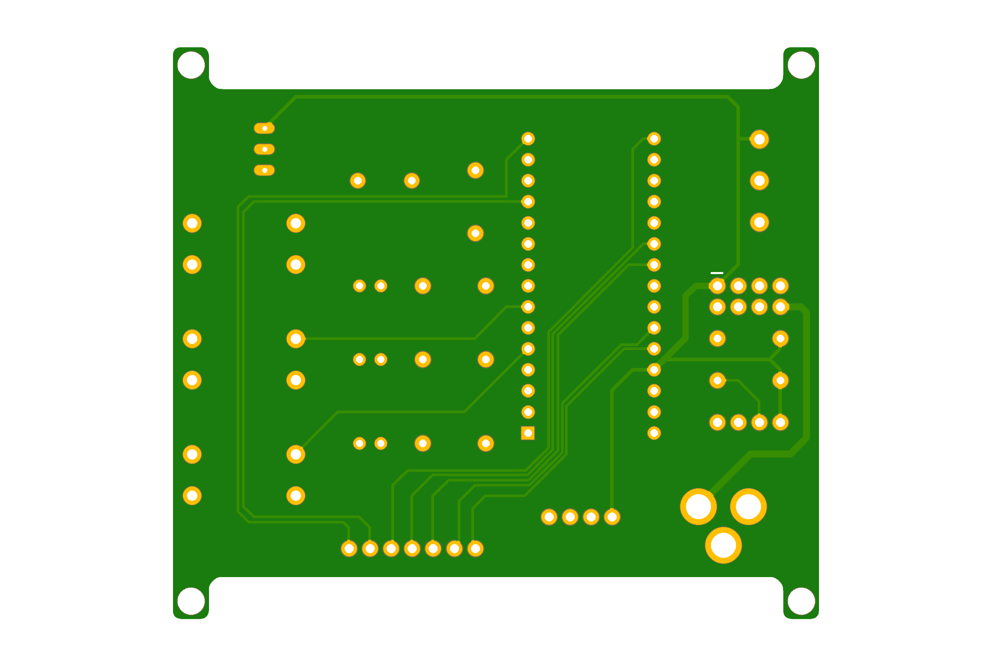

# Maritime LED Beacon - PCB Design v1.0 🌊

## Description
Bu proje, denizcilik sistemlerinde (şamandıra, deniz feneri vb.) kullanılan temel sinyalizasyon mantığını kavramak amacıyla tasarlanmış bir **LED Beacon (İşaret Feneri)** prototipidir. 

Bilgisayar Mühendisliği 1. sınıf öğrencisi olarak, donanım tasarım süreçlerini, şematik okumayı ve PCB üretim standartlarını öğrenmek adına geliştirdiğim ilk somut donanım çalışmasıdır.

---

## Visuals
İnceleyenlerin tasarımı hızlıca görebilmesi için kartın ön ve arka yüz görünümleri aşağıdadır:

### PCB Front View

### PCB Back View

---

## Technical Details & Tools
Tasarım sürecinde endüstriyel standartlara yakın kütüphaneler ve kurallar (DRC) kullanılmıştır.

* **Design Tool:** Autodesk Eagle v9.6.2
* **Libraries:** * [SparkFun Electronics](https://github.com/sparkfun/SparkFun-Eagle-Libraries) (Connectors, LED, PowerSymbols, Resistors, Sensors, Switches)
    * [Custom Library](Design_Files/Custom_Library/) (Özel bileşenler için oluşturulmuştur)
* **Design Rules:** Tasarımda hata payını minimize etmek için [SparkFun DRU](Design_Files/DRU%20File/) dosyaları kullanılarak kontrol sağlanmıştır.

---

## Project Structure
Proje klasörü aşağıdaki gibi organize edilmiştir:

* **[Design_Files](Design_Files):** Kaynak Eagle şematiği (.sch) ve board (.brd) dosyaları.
* **[Gerber](Gerber):** Üretim için hazırlanmış RS-274X formatındaki çıktı dosyaları.
* **[Images](Images):** Yüksek çözünürlüklü tasarım görselleri.

---

## How to Use
1. `/Design_Files` klasöründeki dosyaları Eagle veya herhangi bir uyumlu CAD programı ile açabilirsiniz.
2. Üretim yaptırmak isterseniz `/Gerber` klasöründeki `.zip` dosyasını doğrudan PCB üreticisine (JLCUSB, PCBWay vb.) iletebilirsiniz.

---
**Author:** [Senin Adın]
**Contact:** [E-posta veya LinkedIn Adresin]